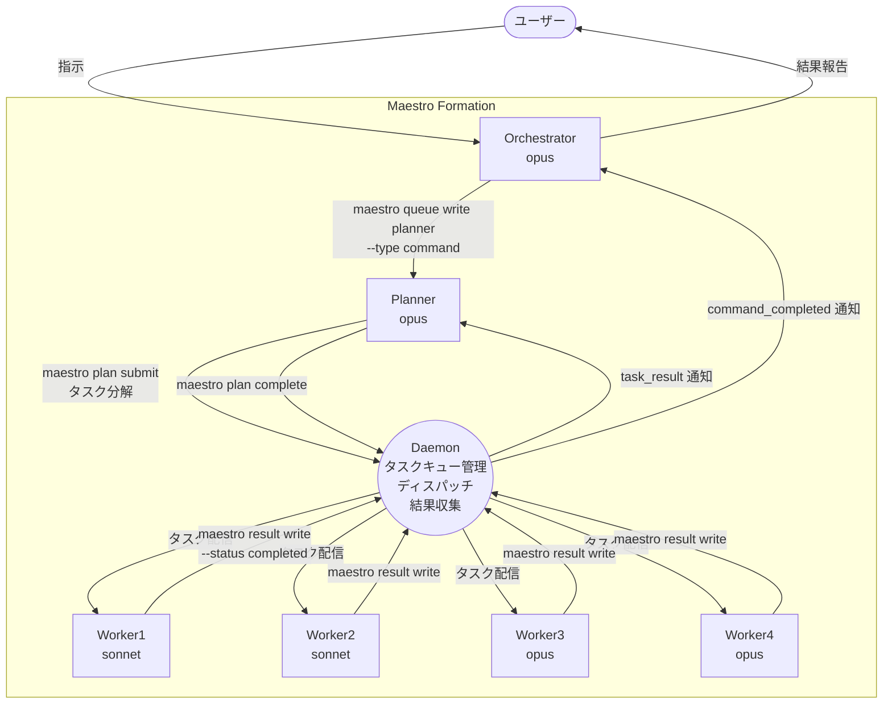
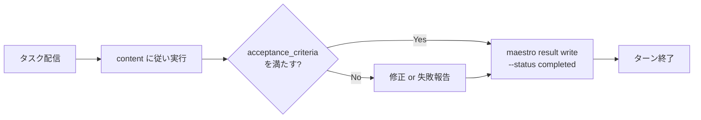
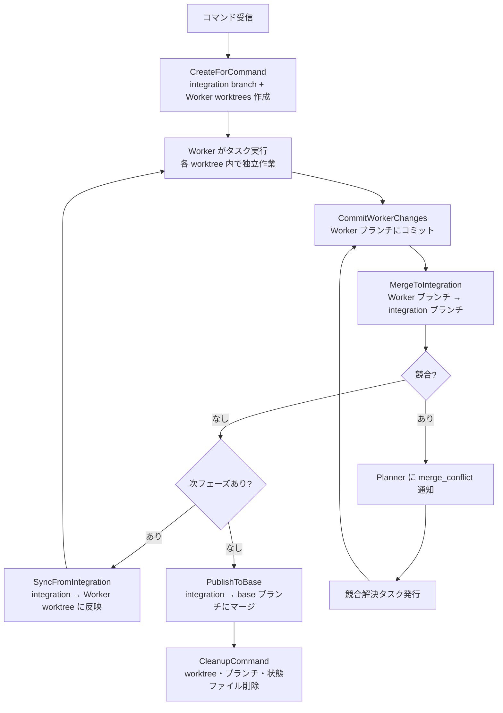

# Maestro v2

Claude Code の複数インスタンスを tmux 上で協調動作させるマルチエージェントオーケストレーションシステム。

Orchestrator / Planner / Worker の 3 層構造で、ユーザーの指示を自動的にタスク分解・並列実行・結果集約する。

## 主な特徴

- **3 層エージェント構造**: Orchestrator（指揮）→ Planner（設計）→ Workers（実行）の明確な責務分離
- **並列タスク実行**: 複数 Worker が独立した tmux ペインで同時にタスクを処理
- **Bloom's Taxonomy によるモデル割当**: タスクの認知的複雑さに応じて Sonnet / Opus を自動選択
- **Worktree ベース並列作業**: git worktree による Worker 間のファイルシステム分離（デフォルト有効）
- **単一ライターアーキテクチャ**: デーモンプロセスが全状態を排他管理し、競合を排除
- **品質ゲートエンジン**: 事前コンパイル済みルールによるタスク品質の自動評価
- **サーキットブレーカー**: 連続失敗検知による自動停止・通知
- **学習知見システム**: Worker の知見を蓄積し後続タスクに自動注入
- **監査ログ**: JSONL 形式のイベント監査ログ（ローテーション対応）。イベントバス経由でタスク開始・完了・フェーズ遷移・キュー書込みイベントを発行
- **自動リコンシリエーション**: 障害時の自動復旧（8 パターン対応）
- **Continuous Mode**: 結果に基づく次コマンドの自動生成

---

## アーキテクチャ概要



### Daemon の役割

Daemon はバックグラウンドプロセスとして動作し、以下を担当する:

- **タスクキュー管理**: YAML ファイルベースのキューの読み書き
- **ディスパッチ**: pending タスクを空き Worker の tmux ペインに配信（at-least-once 保証）
- **リース管理**: タスクごとの排他制御（lease_epoch + TTL）
- **結果収集**: Worker からの完了/失敗報告の処理
- **通知配信**: Planner / Orchestrator への状態変更通知
- **Worktree 管理**: git worktree の作成・マージ・クリーンアップ（有効時）
- **IPC**: Unix Domain Socket（`.maestro/daemon.sock`）経由の CLI ↔ Daemon 通信

### 内部サブシステム

| サブシステム | パッケージ | 概要 |
|---|---|---|
| **品質ゲートエンジン** | `internal/quality/` | `.maestro/quality_gates/*.yaml` のルールを事前コンパイルしたゲートで評価する。`singleflight` と TTL キャッシュで重複評価を抑制。engine / loader / evaluators / cache の 4 モジュール構成 |
| **サーキットブレーカー** | `internal/daemon/circuitbreaker/` | タスクの連続失敗数と進捗停止時間を監視し、閾値超過でコマンドを trip して Planner に通知する |
| **学習知見管理** | `internal/daemon/learnings/` | Worker が報告した知見を `state/learnings.yaml` に蓄積し、TTL 内の最新 K 件を次のタスク本文に注入する |
| **監査ログ / イベントバス** | `internal/events/` | `LogEntry` 構造体で監査イベント（JSONL）を追記し、100MB でローテーション・アーカイブ。`EventBus`（pub/sub）がタスク開始・完了・フェーズ遷移・キュー書込みイベントを配信 |
| **ロック順序検証** | `internal/lock/lock_order_*.go` | `lockorder` ビルドタグ有効時にロック取得順序を検証する。通常ビルドでは no-op（実行時オーバーヘッドなし） |

---

## Agent の種類と責務

### Orchestrator

ユーザーとマルチエージェントフォーメーション間のインターフェース。

| 項目 | 内容 |
|------|------|
| **役割** | ユーザーの意図をコマンドとして構造化し Planner に委譲する |
| **使用可能ツール** | `Bash`（`maestro` コマンドのみ）, `Read`（`.maestro/` 内のみ） |
| **読み取り可能ファイル** | `config.yaml`, `dashboard.md`, `results/planner.yaml` |
| **CLI** | `maestro queue write planner --type command` でコマンド投入 |
| **制約** | 自分でタスク実行しない、コード読まない、Worker に直接指示しない |

**通知の受信**:
- `command_completed` — コマンド正常完了
- `command_failed` — コマンド失敗
- `command_cancelled` — コマンドキャンセル

**Continuous Mode**: 結果に基づき次コマンドを自動生成（未達成目標あり→自動生成、軽微問題→修正コマンド、判断困難→ユーザーに確認、全達成→完了報告）。

### Planner

コマンドをタスクに分解し、Worker による並列実行を設計する戦術的コーディネーター。

| 項目 | 内容 |
|------|------|
| **役割** | Five Questions Analysis でタスクを分析・分解し、Worker への配分を最適化 |
| **使用可能ツール** | `Bash`（`maestro` コマンドのみ）, `Read`（`.maestro/` 内のみ） |
| **読み取り可能ファイル** | `config.yaml`, `dashboard.md`, `results/worker{N}.yaml` |
| **CLI** | `maestro plan submit`（タスク投入）, `maestro plan complete`（完了報告）, `maestro plan add-retry-task`（リトライ） |
| **制約** | 自分でタスク実行しない、コード読まない、Orchestrator に直接報告しない |

**タスク設計原則**:

- **Five Questions Analysis**: What（何をするか）/ Who（誰が担当）/ Order（実行順序）/ Risk（リスク）/ Verify（検証方法）
- **Bloom's Taxonomy**: L1-3 → Sonnet、L4-6 → Opus
- **ファイル競合防止**: 同一ファイルの同時変更を避けるタスク設計
- **自己完結性**: Worker はコンテキストリセットされるため、`content` に全情報を含める
- **タスク粒度**: 1 タスク 5 ファイル以下推奨
- **Wave 構造**: 共通基盤（concrete）→ 並列実装（deferred）
- **Verification フェーズ**: 実装 → 検証 → 修正ループ（最大 2 ラウンド）

**通知の受信**:
- `task_result` — タスク完了/失敗
- フェーズ完了（`awaiting_fill`）— deferred フェーズの実行可能通知
- `circuit_breaker_tripped` — 連続失敗によるサーキットブレーカー発動
- `merge_conflict` — Worktree マージ競合

### Worker

配信されたタスクを実行し、結果を報告する実行専門 Agent。

| 項目 | 内容 |
|------|------|
| **役割** | `content` に従い作業を実行し、`acceptance_criteria` を満たした結果を報告する |
| **使用可能ツール** | 全ツール使用可能 |
| **制約** | スコープ外変更禁止、他 Agent への直接通信禁止、`git push` 禁止、`.maestro/` の読み書き禁止 |

**タスク実行フロー**:



**タスク配信フィールド**:

| フィールド | 説明 |
|---|---|
| `agent_id` | Worker の識別子（例: `worker1`） |
| `task_id` | タスク ID |
| `lease_epoch` | リース番号 |
| `command_id` | 親コマンド ID |
| `purpose` | タスクが全体の中で果たす役割 |
| `content` | 実行すべき作業内容 |
| `acceptance_criteria` | 完了条件 |
| `constraints` | 制約条件（任意） |
| `tools_hint` | 推奨ツール（任意） |
| `persona_hint` | ペルソナ名（任意。implementer/architect/quality-assurance/researcher） |
| `skill_refs` | 参照するスキル名（任意、複数可） |

---

## CLI コマンドリファレンス

### フォーメーション管理

#### `maestro setup <dir> [name]`

`.maestro/` ディレクトリを初期化する。

| 引数/フラグ | 説明 |
|---|---|
| `dir`（必須） | プロジェクトディレクトリ |
| `name`（任意） | プロジェクト名（デフォルト: ディレクトリ名） |

```bash
maestro setup .
maestro setup /path/to/project my-project
```

#### `maestro up [flags]`

フォーメーションを起動する（tmux セッション + デーモン）。

| フラグ | 説明 |
|---|---|
| `--boost` | 全 Worker のモデルを Opus に昇格 |
| `--continuous` | 継続実行モードを有効化 |
| `--detach`, `-d` | tmux にアタッチしない |
| `--force`, `-f` | 既存セッションを再作成 |

```bash
maestro up
maestro up --boost --continuous
maestro up --detach
```

#### `maestro down`

フォーメーションをグレースフルシャットダウンする。

```bash
maestro down
```

#### `maestro status [--json]`

フォーメーションの現在の状態を表示する。

```bash
maestro status          # テキスト出力
maestro status --json   # JSON 出力
```

JSON 出力例:
```json
{
  "daemon": {"running": true, "pid": "12345"},
  "agents": [{"id": "orchestrator", "role": "orchestrator", "model": "opus", "status": "idle"}],
  "queues": [{"name": "planner", "pending": 0, "in_progress": 1}]
}
```

### キュー操作

#### `maestro queue write <target> --type <type> [options]`

キューにエントリを書き込む。

| type | 必須フラグ | 用途 |
|---|---|---|
| `command` | `--content` | コマンド投入（Orchestrator → Planner） |
| `task` | `--command-id`, `--content`, `--purpose`, `--acceptance-criteria`, `--bloom-level` | タスク投入（Planner → Worker） |
| `notification` | `--command-id`, `--content`, `--source-result-id` | 通知送信 |
| `cancel-request` | `--command-id` | キャンセル要求 |

**共通オプションフラグ**:

| フラグ | 対応 type | 説明 |
|---|---|---|
| `--priority` | `command`, `task`, `notification` | 優先度（整数） |
| `--reason` | `cancel-request` | キャンセル理由 |

**task 型の追加フラグ**:

| フラグ | 説明 |
|---|---|
| `--blocked-by` | 依存タスク ID（複数指定可） |
| `--constraint` | 制約条件（複数指定可） |
| `--tools-hint` | 推奨ツール（複数指定可） |

**notification 型の追加フラグ**:

| フラグ | 説明 |
|---|---|
| `--notification-type` | 通知の種別（任意） |

```bash
# コマンド投入
maestro queue write planner --type command --content "認証機能を実装して"

# タスク投入
maestro queue write worker1 --type task \
  --command-id cmd_xxx \
  --purpose "ログイン API" \
  --content "JWT ベースのログインエンドポイントを実装" \
  --acceptance-criteria "POST /api/login が 200 を返す" \
  --bloom-level 4

# キャンセル要求
maestro queue write planner --type cancel-request --command-id cmd_xxx --reason "不要になった"
```

**終了コード**: `0`=成功、`2`=BACKPRESSURE、`1`=その他エラー

### プラン操作

#### `maestro plan submit --command-id <id> [flags]`

タスクプラン（YAML）を提出する。

| フラグ | 説明 |
|---|---|
| `--tasks-file` | YAML ファイルパス（`-` で stdin、デフォルト: stdin） |
| `--phase` | フェーズ名（deferred フェーズへの充填時） |
| `--dry-run` | 検証のみ（実際には投入しない） |

```bash
maestro plan submit --command-id cmd_xxx --tasks-file plan.yaml
maestro plan submit --command-id cmd_xxx --phase "phase2" --tasks-file tasks.yaml
```

#### `maestro plan complete --command-id <id> [--summary <text>]`

コマンドの完了を報告する。

```bash
maestro plan complete --command-id cmd_xxx --summary "全タスク完了"
```

#### `maestro plan add-retry-task --command-id <id> [flags]`

失敗タスクのリトライタスクを追加する。

| フラグ | 説明 |
|---|---|
| `--retry-of`（必須） | リトライ元のタスク ID |
| `--purpose`（必須） | タスクの目的 |
| `--content`（必須） | 作業内容 |
| `--acceptance-criteria`（必須） | 完了条件 |
| `--bloom-level`（必須） | Bloom's Taxonomy レベル（整数） |
| `--blocked-by` | 依存タスク ID（複数指定可） |

```bash
maestro plan add-retry-task --command-id cmd_xxx \
  --retry-of task_yyy \
  --purpose "修正版" \
  --content "エラーを修正して再実装" \
  --acceptance-criteria "テスト通過" \
  --bloom-level 4
```

#### `maestro plan request-cancel --command-id <id> [flags]`

コマンドのキャンセルを要求する。

| フラグ | 説明 |
|---|---|
| `--requested-by` | 要求元（デフォルト: `cli`） |
| `--reason` | キャンセル理由 |

```bash
maestro plan request-cancel --command-id cmd_xxx --reason "方針変更"
```

#### `maestro plan rebuild --command-id <id>`

結果ファイルからコマンドの状態を再構築する（障害復旧用）。

```bash
maestro plan rebuild --command-id cmd_xxx
```

### 結果報告

#### `maestro result write <reporter> [flags]`

タスクの結果を報告する（Worker が使用）。

| フラグ | 説明 |
|---|---|
| `--task-id`（必須） | タスク ID |
| `--command-id`（必須） | コマンド ID |
| `--lease-epoch` | リース番号（整数、デフォルト: 0） |
| `--status`（必須） | `completed` または `failed` |
| `--summary` | 結果の要約 |
| `--files-changed` | 変更したファイル（複数指定可） |
| `--learnings` | 再利用可能な知見（複数指定可） |
| `--partial-changes` | 部分的な変更がある場合に指定 |
| `--no-retry-safe` | リトライが安全でない場合に指定 |

```bash
maestro result write worker1 \
  --task-id task_xxx \
  --command-id cmd_xxx \
  --lease-epoch 3 \
  --status completed \
  --summary "実装完了" \
  --files-changed src/auth.go \
  --files-changed src/auth_test.go
```

**終了コード**: `0`=成功、`2`=FENCING_REJECT（リース期限切れ）、`1`=その他エラー

### タスク管理（内部）

#### `maestro task heartbeat --task-id <id> --worker-id <id> --epoch <n>`

タスク実行中のハートビートを送信する（Daemon 内部使用）。

**終了コード**: `0`=成功、`2`=MAX_RUNTIME_EXCEEDED、`1`=その他エラー

### Agent 管理（内部）

#### `maestro agent launch`

tmux ペイン内で Claude CLI エージェントを起動する（`maestro up` が自動実行）。

#### `maestro agent exec --agent-id <id> [flags]`

エージェントにメッセージを配信する（Daemon がタスク配信時に内部使用）。

| フラグ | 説明 |
|---|---|
| `--mode` | `deliver`（デフォルト）, `with_clear`, `interrupt`, `is_busy`, `clear` |
| `--message` | 配信メッセージ |
| `--with-clear` | `--mode with_clear` の省略形 |
| `--interrupt` | `--mode interrupt` の省略形 |
| `--is-busy` | `--mode is_busy` の省略形 |
| `--clear` | `--mode clear` の省略形 |

### スキル管理

#### `maestro skill list [--role <role>]`

登録済みスキルの一覧を表示する。`--role` でロール別にフィルタ可能。

```bash
maestro skill list
maestro skill list --role worker
```

#### `maestro skill candidates [--status <status>]`

スキル候補（`state/skill_candidates.yaml`）の一覧を表示する。

| フラグ | 説明 |
|---|---|
| `--status` | ステータスでフィルタ: `pending`, `approved`, `rejected` |

```bash
maestro skill candidates
maestro skill candidates --status pending
```

#### `maestro skill approve <candidate-id> [--name <skill-name>]`

スキル候補を承認し、`skills/share/` に SKILL.md として保存する。

| フラグ | 説明 |
|---|---|
| `--name` | スキル名（kebab-case、a-z0-9 とハイフン、1-64 文字） |

```bash
maestro skill approve cand_xxx
maestro skill approve cand_xxx --name my-custom-skill
```

#### `maestro skill reject <candidate-id>`

スキル候補を却下する。

```bash
maestro skill reject cand_xxx
```

### Worker 管理

#### `maestro worker standby [--model <model>]`

アイドル状態の Worker 一覧を取得する。

```bash
maestro worker standby
maestro worker standby --model opus
```

### ユーティリティ

#### `maestro dashboard`

`dashboard.md` を再生成する（ログ末尾 512KB から統計・イベント・エラーを集計）。

```bash
maestro dashboard
```

#### `maestro version`

バージョンを表示する。

```bash
maestro version
# => maestro 2.0.0
```

---

## Worktree 機能

### 概要

Worktree 機能は git worktree を利用して各 Worker に独立したファイルシステムを提供する。これにより、複数 Worker が同時に異なるファイルを編集しても互いに干渉しない。

### 有効化

Worktree はデフォルトで有効。無効化する場合は `config.yaml` で `worktree.enabled: false` を設定する。

```yaml
worktree:
  enabled: true
  base_branch: "main"
  path_prefix: ".maestro/worktrees"
  auto_commit: true
  auto_merge: true
  merge_strategy: "ort"
  cleanup_on_success: true
  cleanup_on_failure: false
  git_timeout_sec: 120
  gc:
    enabled: true
    ttl_hours: 24
    max_worktrees: 32
```

### ライフサイクル



**状態遷移**（Worker worktree）:
- 正常系: `created` → `active` → `committed` → `integrated` → `published` → `cleanup_done`
- 異常系: 任意の状態から `conflict`（マージ競合時）、`failed`（git エラー時）、`cleanup_failed`（削除失敗時）

### コンフリクト解決フロー

1. `MergeToIntegration` で競合を検知
2. Planner に `kind:merge_conflict` 通知が送信される（`conflicting_files`, `workers` 情報付き）
3. Planner が競合解決タスクを Worker に発行（`acceptance_criteria` に競合マーカー不在を含める）
4. 最大 2 回リトライ。未解決なら summary に記載して `plan complete`

### ファイル競合の緩和

- 同一フェーズ内で同じファイルの並行変更が可能（worktree 分離のため実行時は干渉しない）
- マージ時に競合する可能性がある → 同一箇所の変更は `blocked_by` 推奨
- 異なるファイル or 同一ファイルの異なる箇所は安全に並列実行可能

---

## 設定（config.yaml）

`.maestro/config.yaml` の全設定項目。

### プロジェクト

```yaml
project:
  name: "my-project"
  description: "プロジェクトの説明"
```

### エージェント

```yaml
agents:
  orchestrator:
    id: "orchestrator"
    model: "opus"
  planner:
    id: "planner"
    model: "opus"
  workers:
    count: 4                    # Worker 数 (1-8)
    default_model: "sonnet"     # デフォルトモデル
    models:                     # Worker ごとのモデル指定
      worker3: "opus"
      worker4: "opus"
    boost: false                # true で全 Worker を Opus に
```

### Bloom's Taxonomy とモデル割当

タスクの認知的複雑さに応じて自動的にモデルを割り当てる。

| レベル | 分類 | モデル | 例 |
|--------|------|--------|----|
| L1 記憶 | 定型的な変更・設定 | Sonnet | 設定ファイルの変更 |
| L2 理解 | 既存コードの読解・修正 | Sonnet | バグ修正 |
| L3 応用 | パターン適用・実装 | Sonnet | 既知パターンの実装 |
| L4 分析 | 設計判断・リファクタリング | Opus | コードベース調査 |
| L5 評価 | アーキテクチャ評価・最適化 | Opus | 設計レビュー |
| L6 創造 | 新規設計・アルゴリズム創出 | Opus | 新規アーキテクチャ設計 |

`--boost` フラグまたは `workers.boost: true` で全 Worker を Opus に昇格可能。

### Continuous Mode

```yaml
continuous:
  enabled: false              # 継続モード
  max_iterations: 10          # 最大イテレーション数
  pause_on_failure: true      # 失敗時に一時停止
```

### Watcher（スキャン設定）

```yaml
watcher:
  debounce_sec: 0.3           # ファイル変更検知のデバウンス
  scan_interval_sec: 60       # 定期スキャン間隔 (秒)
  dispatch_lease_sec: 300     # リース期間 (秒)
  max_in_progress_min: 30     # タスク実行の最大時間 (分)
  idle_stable_sec: 5          # アイドル安定化時間
  cooldown_after_clear: 3     # clear 後のクールダウン (秒)
  notify_lease_sec: 120       # 通知リース期間 (秒)
  busy_check_interval: 2      # ビジーチェック間隔 (秒)
  busy_check_max_retries: 30  # ビジーチェック最大リトライ
  busy_patterns: "Working|Thinking|Planning|Sending|Searching"  # ビジー判定パターン
  wait_ready_interval_sec: 2   # Agent 起動待機間隔 (秒、コードデフォルト)
  wait_ready_max_retries: 30   # Agent 起動待機最大リトライ
  clear_confirm_timeout_sec: 5 # clear 確認タイムアウト (秒、コードデフォルト)
  clear_confirm_poll_ms: 250   # clear 確認ポーリング間隔 (ミリ秒)
  clear_max_attempts: 3        # clear 送信試行回数
  clear_retry_backoff_ms: 500  # clear リトライバックオフ (ミリ秒)
```

### リトライ

```yaml
retry:
  command_dispatch: 5         # コマンドディスパッチの最大リトライ
  task_dispatch: 5            # タスクディスパッチの最大リトライ
  orchestrator_notification_dispatch: 10  # Orchestrator 通知の最大リトライ
  task_execution:
    enabled: true
    retryable_exit_codes: [1, 124, 137]
    max_retries: 2
    cooldown_sec: 30
```

### キュー

```yaml
queue:
  priority_aging_sec: 300       # 優先度エイジング間隔 (秒)
```

### デーモン

```yaml
daemon:
  shutdown_timeout_sec: 90      # グレースフルシャットダウンタイムアウト (秒)
```

### ログ

```yaml
logging:
  level: "info"                 # ログレベル (debug, info, warn, error)
```

### 制限値

```yaml
limits:
  max_pending_commands: 20              # 最大 pending コマンド数
  max_pending_tasks_per_worker: 10      # Worker あたり最大 pending タスク数
  max_entry_content_bytes: 65536        # エントリの最大サイズ (64KB)
  max_yaml_file_bytes: 5242880          # YAML ファイルの最大サイズ (5MB)
  max_dead_letter_archive_files: 100    # dead_letters の最大保持数
  max_quarantine_files: 100             # quarantine の最大保持数
```

### サーキットブレーカー

タスクの連続失敗または進捗停止を検知し、コマンドを自動停止して Planner に `circuit_breaker_tripped` 通知を送信する。

```yaml
circuit_breaker:
  enabled: false                   # opt-in
  max_consecutive_failures: 3      # 連続失敗でトリップ
  progress_timeout_minutes: 30     # 進捗タイムアウト (分)
```

### Learnings（学習知見）

Worker が `--learnings` フラグで報告した知見を `state/learnings.yaml` に蓄積し、TTL 内の最新 K 件を後続タスクの本文に自動注入する。

```yaml
learnings:
  enabled: false                    # opt-in
  max_entries: 100                  # 蓄積上限件数
  max_content_length: 500           # 1 件あたりの最大文字数
  inject_count: 5                   # タスク配信時に注入する最新 K 件
  ttl_hours: 72                     # 有効期限 (時間)
```

### Verification（検証コマンド）

```yaml
verification:
  enabled: false                    # opt-in
  basic_command: "go vet ./..."     # 基本検証コマンド
  full_command: "go test ./..."     # 完全検証コマンド
  timeout_seconds: 300              # タイムアウト (秒)
  max_retries: 1                    # フレークテスト対策リトライ
```

### Skills（スキル参照）

Worker のタスクにスキル（再利用可能な知識テンプレート）を自動参照させる機能。

```yaml
skills:
  enabled: true                     # スキル参照機能の有効化フラグ (opt-in)
  max_refs_per_task: 3              # タスクあたりの最大スキル参照数
  max_body_chars: 2000              # スキル本文の最大文字数
  missing_ref_policy: "warn"        # 参照先スキルが見つからない場合の動作: "warn" or "error"
  auto_collect:
    enabled: false                  # 学習知見からの自動スキル収集 (opt-in)
    min_occurrences: 3              # 自動収集の最小出現回数
    min_commands: 2                 # 自動収集の最小コマンド数
```

### Personas（ペルソナ）

Worker に割り当てるペルソナ（作業視点）の定義。`templates/persona/` にテンプレートを配置する。

```yaml
personas:
  implementer:
    description: "実装者。コード実装・修正・ドキュメント作成に集中する"
    file: "persona/implementer.md"
  architect:
    description: "設計者。アーキテクチャ策定・設計判断・大規模構造変更の方針決定を行う"
    file: "persona/architect.md"
  quality-assurance:
    description: "品質保証。テスト・レビュー・品質検証・セキュリティ分析に集中する"
    file: "persona/quality-assurance.md"
  researcher:
    description: "調査者。情報収集・分析・調査レポート作成に集中する"
    file: "persona/researcher.md"
```

### Quality Gates（品質ゲート）

`.maestro/quality_gates/*.yaml` からルール定義を読み込み、事前コンパイルしたゲートでタスクの状態を評価する。`singleflight` と TTL キャッシュにより重複評価を抑制する（engine / loader / evaluators / cache の 4 モジュール構成）。`config.yaml` の `thresholds` は簡易閾値設定用。

```yaml
quality_gates:
  enabled: false
  skip_gates: false                 # 緊急モード (--skip-gates フラグで有効化)
  thresholds:
    max_task_failure_rate: 0.3      # タスク失敗率の上限 (30%)
    min_task_success_rate: 0.7      # タスク成功率の下限 (70%)
    max_consecutive_failures: 3     # 連続失敗の上限
    max_task_duration_sec: 300      # タスク実行時間の上限 (5分)
    max_pending_tasks: 50           # ペンディングタスクの上限
  enforcement:
    pre_task_check: true            # タスク実行前チェック
    post_task_check: false          # タスク実行後チェック
    failure_action: "warn"          # "warn" or "block"
    log_violations: true            # 違反をログに記録
```

### Worktree

```yaml
worktree:
  enabled: true                     # デフォルト有効
  base_branch: "main"              # ベースブランチ
  path_prefix: ".maestro/worktrees" # worktree 作成先
  auto_commit: true                # Phase 完了時の自動コミット
  auto_merge: true                 # Phase 境界での自動マージ
  merge_strategy: "ort"            # git merge 戦略
  cleanup_on_success: true         # 成功時の自動クリーンアップ
  cleanup_on_failure: false        # 失敗時のクリーンアップ
  git_timeout_sec: 120             # git コマンドのタイムアウト (秒)
  commit_policy:
    max_files: 30                  # 1コミットあたりの最大ステージングファイル数 (0=無制限)
    require_gitignore: true        # .gitignore の存在を要求する
    message_pattern: "^\\[maestro\\]\\s" # コミットメッセージの正規表現バリデーション (空=チェックなし)
  gc:
    enabled: true                  # 定期 GC
    ttl_hours: 24                  # 古い worktree の TTL
    max_worktrees: 32              # 最大 worktree 数
```

---

## セットアップ・起動方法

### 前提条件

- **Go** 1.26+
- **tmux**
- **Claude Code CLI** (`claude`)

```bash
# macOS
brew install tmux go

# Ubuntu / Debian
sudo apt update && sudo apt install -y tmux golang

# Claude Code CLI (共通)
npm install -g @anthropic-ai/claude-code
```

### インストール

```bash
git clone https://github.com/msageha/maestro_v2.git
cd maestro_v2
./install.sh
```

`install.sh` は依存チェック → `go build` → `~/bin/maestro` へ配置を行う。
インストール先は環境変数 `MAESTRO_INSTALL_DIR` で変更可能。

### 初期設定

```bash
# プロジェクトディレクトリで初期化
maestro setup .

# config.yaml を必要に応じて編集
# vim .maestro/config.yaml
```

### 起動

```bash
# フォーメーション起動
maestro up

# tmux セッションにアタッチ（Orchestrator ペインで指示を出す）
tmux attach -t maestro

# ウィンドウ切り替え: Ctrl-b + 0(Orchestrator) / 1(Planner) / 2(Workers)
# ペイン切り替え (Worker 間): Ctrl-b + 矢印キー

# 終了
maestro down
```

### tmux セッション構成

| ウィンドウ | エージェント | 役割 |
|------------|-------------|------|
| 0 | Orchestrator | ユーザーとの対話、進捗管理 |
| 1 | Planner | タスク分解、完了判定 |
| 2 | Worker1〜N | タスク実行（2 列グリッドレイアウト） |

---

## ディレクトリ構造

`maestro setup` で生成される `.maestro/` の構造:

```
.maestro/
├── config.yaml              # 設定ファイル
├── maestro.md               # コマンドログ
├── dashboard.md             # ステータスダッシュボード
├── instructions/            # エージェントごとのシステムプロンプト
│   ├── orchestrator.md
│   ├── planner.md
│   └── worker.md
├── queue/                   # キューファイル (YAML)
│   ├── planner.yaml         # コマンドキュー
│   ├── orchestrator.yaml    # 通知キュー
│   └── worker{1..N}.yaml    # タスクキュー
├── results/                 # 結果ファイル (YAML)
│   ├── planner.yaml         # コマンド結果
│   └── worker{1..N}.yaml    # タスク結果
├── state/
│   ├── commands/            # コマンドごとの状態 (正本)
│   ├── worktrees/           # Worktree 状態 (有効時)
│   ├── metrics.yaml         # メトリクス
│   └── continuous.yaml      # 継続モード状態
├── locks/                   # デーモンロック
├── logs/                    # デーモンログ
├── dead_letters/            # 配信失敗エントリ
└── quarantine/              # 破損 YAML の退避先
```

## テンプレート（templates/）

`maestro setup` 時にコピーされるテンプレートファイル群。`templates/embed.go` で Go バイナリに埋め込まれる。

```
templates/
├── config.yaml              # デフォルト設定
├── dashboard.md             # ダッシュボードテンプレート
├── maestro.md               # 共通プロンプト
├── embed.go                 # Go embed 定義
├── instructions/            # エージェント指令書
│   ├── orchestrator.md
│   ├── planner.md
│   └── worker.md
├── persona/                 # ペルソナ定義
│   ├── implementer.md
│   ├── architect.md
│   ├── quality-assurance.md
│   └── researcher.md
└── skills/                  # 組み込みスキル
    ├── orchestrator/        # Orchestrator 用スキル
    ├── planner/             # Planner 用スキル
    ├── worker/              # Worker 用スキル
    └── share/               # 共有スキル
```

---

## 開発

### Makefile ターゲット

| ターゲット | 説明 |
|-----------|------|
| `make all` | lint → test → build を順に実行 |
| `make build` | Go バイナリをビルド |
| `make install` | ビルドして `~/Works/bin` にインストール |
| `make clean` | ビルド成果物を削除 |
| `make test` | 全テストを実行 |
| `make test-v` | verbose モードでテスト |
| `make test-race` | Race detector 付きでテスト |
| `make test-cover` | カバレッジレポートを生成 |
| `make lint` | golangci-lint を実行 |
| `make lint-fix` | golangci-lint の自動修正を適用 |
| `make format` | gofmt + goimports でフォーマット |
| `make vet` | go vet を実行 |
| `make help` | ターゲット一覧を表示 |

### CI（GitHub Actions）

`.github/workflows/ci.yml` で以下のジョブが実行される:

| ジョブ | 内容 |
|-------|------|
| `build-and-test` | checkout → Go セットアップ → 依存取得 → build → vet → test → test -race |
| `lint` | checkout → Go セットアップ → golangci-lint |

### 手動実行

```bash
# ビルド
go build -o maestro ./cmd/maestro/

# テスト
go test ./...

# 特定パッケージのテスト
go test ./internal/daemon/...
go test ./internal/plan/...

# ベンチマーク
go test -bench=. ./internal/uds/...
go test -bench=. ./internal/yaml/...
go test -bench=. ./internal/plan/...
go test -bench=. ./internal/daemon/...
```

ベンチマークテストは `internal/uds/`、`internal/yaml/`、`internal/plan/`、`internal/daemon/` に配置されている。

---

## 関連ドキュメント

| ファイル | 内容 |
|---------|------|
| `LOCK_ORDER.md` | ロック取得順序の正規定義。`queue:*`(L1) → `state:*`(L2) → `result:*`(L3) の 3 レベル。`-tags lockorder` で実行時検証可能 |
| `docs/requirements/` | 設計仕様書（01〜11 + abstract）。システム概要・ユーザーフロー・ファイル構造・YAML スキーマ・スクリプト責務・実行フロー・エラーハンドリング・tmux 操作・安全規則・Continuous Mode・将来拡張 |
