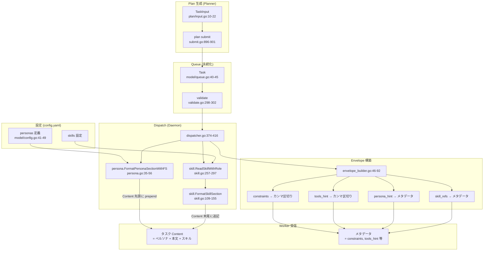
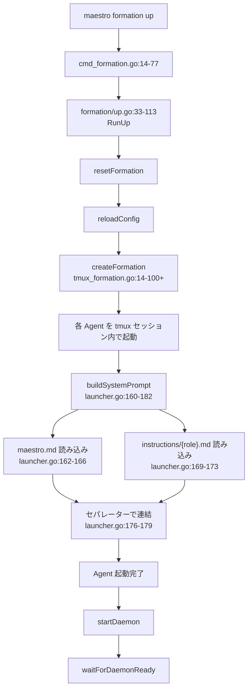

# Maestro v2 ペルソナ・タスクフィールド データフローレポート

## 1. 概要

Maestro v2 では、タスクに付与される以下のフィールドが、Plan 生成からタスク配信・実行まで一貫したパイプラインで処理される。

| フィールド | 役割 | 強制力 |
|-----------|------|--------|
| `persona_hint` | Worker の作業視点・行動指針を指定する | タスク Content への注入（推奨） |
| `constraints` | タスクの制約条件を定義する | Content 内に記載（推奨） |
| `tools_hint` | 推奨ツールを提示する | Content 内に記載（**推奨のみ、強制メカニズムなし**） |
| `skill_refs` | タスクに注入するスキル定義を指定する | Content 末尾に注入（DATA ONLY セクション） |

---

## 2. ペルソナシステムのデータフロー

### 2.1 Config 定義

ペルソナは `config.yaml` で定義される。

**テンプレート:** `templates/config.yaml:123-135`

```yaml
personas:
  implementer:
    description: "コード実装・修正・ドキュメント作成"
    file: "implementer.md"
  architect:
    description: "設計判断・アーキテクチャ策定"
    file: "architect.md"
  quality-assurance:
    description: "テスト・レビュー・品質検証"
    file: "quality-assurance.md"
  researcher:
    description: "情報収集・分析・調査レポート作成"
    file: "researcher.md"
```

**Go 構造体:** `internal/model/config.go:41-49`

```go
type PersonaConfig struct {
    Description string `yaml:"description"`
    Prompt      string `yaml:"prompt"`
    File        string `yaml:"file,omitempty"`
}
```

- `Prompt` または `File` のいずれかが必須（両方空はバリデーションエラー）

### 2.2 バリデーション

**`internal/model/config.go:529-537`**

- ペルソナ名が有効な ID かチェック
- `Prompt` と `File` の両方が空の場合エラー

### 2.3 ペルソナプロンプトの読み込み

**`internal/daemon/persona/persona.go:35-56`** — `FormatPersonaSectionWithFS`

1. 指定されたペルソナ名で config から `PersonaConfig` を取得
2. `resolvePrompt()` でプロンプト本文を解決
3. フロントマター（YAML ヘッダー）を除去
4. フォーマットして返却

**`internal/daemon/persona/persona.go:58-76`** — `resolvePrompt`

解決の優先順位:

| 優先度 | ソース | 説明 |
|--------|--------|------|
| 1 | `File` フィールド → 埋め込み FS | `templates/persona/{name}.md` を読み込み |
| 2 | `Prompt` フィールド | File が失敗した場合のフォールバック |

**フロントマター除去:** `persona.go:78-97` — `---` で囲まれた YAML ヘッダーを削除

### 2.4 組み込みペルソナファイル

`templates/persona/` ディレクトリ:

| ファイル | ペルソナ |
|---------|---------|
| `implementer.md` | コード実装・修正 |
| `architect.md` | 設計・アーキテクチャ |
| `quality-assurance.md` | テスト・品質検証 |
| `researcher.md` | 情報収集・分析 |

---

## 3. persona_hint のデータフロー

persona_hint は Plan 生成時にタスクに付与され、dispatch 時に Content へ注入される。

### フロー詳細

| ステップ | ファイル:行 | 処理内容 |
|---------|------------|---------|
| 1. Plan 入力定義 | `internal/plan/input.go:20` | `TaskInput.PersonaHint string` |
| 2. Plan submit | `internal/plan/submit.go:900` | TaskInput → Task 変換時にコピー |
| 3. Queue モデル | `internal/model/queue.go:44` | `Task.PersonaHint string` |
| 4. CLI キュー書き込み | `internal/cli/cmd_queue.go:50,108` | CLI フラグ定義 |
| 5. キューハンドラ | `internal/cli/queue_write_handler.go:31,258` | YAML → Task 変換 |
| 6. **Dispatch 注入** | `internal/daemon/dispatcher.go:374-381` | `FormatPersonaSectionWithFS()` → `task.Content` に **prepend** |
| 7. Envelope メタデータ | `internal/agent/envelope_builder.go:73-77` | メタデータとして表示 |
| 8. リトライ保持 | `internal/daemon/retry.go:30,223,253` | リトライ時に persona_hint を保持 |

### 注入のタイミング

**重要:** ペルソナプロンプトは Agent 起動時のシステムプロンプトには含まれない。タスク単位で dispatch 時に `task.Content` の先頭に注入される。

---

## 4. constraints のデータフロー

constraints はタスクレベルとフェーズレベルの 2 種類が存在する。

### 4.1 タスクレベル constraints

| ステップ | ファイル:行 | 処理内容 |
|---------|------------|---------|
| 1. Plan 入力定義 | `internal/plan/input.go:15` | `TaskInput.Constraints []string` |
| 2. Queue モデル | `internal/model/queue.go:40` | `Task.Constraints []string` |
| 3. バリデーション | `internal/model/validate.go:298-302` | 各 constraint を 1024 rune 以内に制限 |
| 4. Plan submit | `internal/plan/submit.go:896` | Queue 書き込み時にコピー |
| 5. Envelope 構築 | `internal/agent/envelope_builder.go:55-63` | カンマ区切り文字列に変換して配信 |
| 6. リトライ保持 | `internal/daemon/retry.go:251` | deep copy で保持 |
| 7. リトライハンドラ | `internal/daemon/task_retry_handler.go:102` | deep copy で保持 |

### 4.2 フェーズレベル constraints

| ステップ | ファイル:行 | 処理内容 |
|---------|------------|---------|
| 1. 入力定義 | `internal/plan/input.go:30-38` | `ConstraintInput` 構造体 |
| 2. State モデル | `internal/model/state.go:60,68-72` | `PhaseConstraints` 構造体 |
| 3. Plan submit 生成 | `internal/plan/submit.go:387-396` | bloom_level 未設定時にデフォルト [1-6] を付与 |

---

## 5. tools_hint のデータフロー

### フロー詳細

| ステップ | ファイル:行 | 処理内容 |
|---------|------------|---------|
| 1. Plan 入力定義 | `internal/plan/input.go:19` | `TaskInput.ToolsHint []string` |
| 2. Queue モデル | `internal/model/queue.go:43` | `Task.ToolsHint []string` |
| 3. Plan submit | `internal/plan/submit.go:899` | Queue 書き込み時にコピー |
| 4. CLI キュー書き込み | `internal/cli/queue_write_handler.go:30,257` | YAML → Task 変換 |
| 5. Envelope 構築 | `internal/agent/envelope_builder.go:64-72` | カンマ区切り文字列に変換 |
| 6. リトライ保持 | `internal/daemon/retry.go:222,252` | リトライ時に保持 |
| 7. リトライハンドラ | `internal/daemon/task_retry_handler.go:102` | deep copy で保持 |

### ⚠️ 重要な注意点

**`tools_hint` は推奨のみであり、ツール使用を制限する強制メカニズムは存在しない。**

- Envelope に「推奨ツール」として記載されるのみ
- Worker の `--disallowedTools` やツールフィルタリングへの変換機構はない
- Worker は tools_hint を無視して任意のツールを使用できる

---

## 6. skill_refs のデータフロー

### フロー詳細

| ステップ | ファイル:行 | 処理内容 |
|---------|------------|---------|
| 1. Plan 入力定義 | `internal/plan/input.go:21` | `TaskInput.SkillRefs []string` |
| 2. Queue モデル | `internal/model/queue.go:45` | `Task.SkillRefs []string` |
| 3. Plan submit | `internal/plan/submit.go:901` | Queue 書き込み時にコピー |
| 4. **Dispatch 注入** | `internal/daemon/dispatcher.go:384-416` | スキル読み込み → Content 末尾に追記 |
| 5. Envelope メタデータ | `internal/agent/envelope_builder.go:78-86` | メタデータとして表示 |
| 6. リトライ保持 | `internal/daemon/retry.go:224,254` | リトライ時に保持 |

### Dispatch 時のスキル注入処理

**`internal/daemon/dispatcher.go:384-416`**

1. `config.Skills.Enabled && len(task.SkillRefs) > 0` で発火
2. 各スキル参照に対して `skill.ReadSkillWithRole()` を呼び出し

**スキル読み込み優先順位** (`internal/daemon/skill/skill.go:257-297` — `ReadSkillWithRole`):

| 優先度 | パス |
|--------|------|
| 1 | `.maestro/skills/{role}/{skillName}/SKILL.md` |
| 2 | `.maestro/skills/share/{skillName}/SKILL.md` |
| 3 | `.maestro/skills/{skillName}/SKILL.md` |

3. `skill.FormatSkillSection()` (`skill.go:109-155`) でフォーマット
   - 優先度ベースのトランケーション
   - `max_body_chars` による文字数制限
4. **DATA ONLY セクション**として `task.Content` 末尾に追記

### エラーハンドリング

| `missing_ref_policy` | 動作 |
|---------------------|------|
| `error` | スキルが見つからない場合エラー |
| `warn` | 警告を出力して続行 |

### 制限

| 設定項目 | 説明 |
|---------|------|
| `max_refs_per_task` | タスクあたりのスキル参照数上限 |
| `max_body_chars` | スキル本文の最大文字数 |

---

## 7. Agent 指令書の組み立てフロー

### 7.1 Formation Up

**`internal/cli/cmd_formation.go:14-77`** → **`internal/formation/up.go:33-113`**

```
maestro formation up
  → RunUp()
    → resetFormation()
    → reflectFlags()
    → reloadConfig()
    → activateContinuousMode()
    → startupRecovery()
    → saveServerOptions()
    → createFormation()        ← Agent 起動
    → startDaemon()
    → waitForDaemonReady()
```

### 7.2 Agent 起動とシステムプロンプト

**`internal/formation/tmux_formation.go:14-100+`** — tmux セッション内で各 Agent を起動

**`internal/agent/launcher.go:71-182`** — `buildSystemPrompt`

システムプロンプトの構成:

| 順序 | ソース | 説明 |
|------|--------|------|
| 1 | `.maestro/maestro.md` | 共通プロンプト（全ロール共通） |
| 2 | `.maestro/instructions/{role}.md` | ロール固有の指令書 |

- `launcher.go:162-166` — maestro.md 読み込み
- `launcher.go:169-173` — instructions/{role}.md 読み込み
- `launcher.go:176-179` — セパレーターで連結

**注意:** ペルソナプロンプトはシステムプロンプトには含まれない。タスク dispatch 時に動的注入される。

### 7.3 タスク配信時の Content 組み立て

Dispatch 時に Content が以下の順序で組み立てられる:

| 順序 | 注入内容 | 注入位置 |
|------|---------|---------|
| 1 | ペルソナプロンプト | Content **先頭** に prepend |
| 2 | 元の Content | 中央（Planner が生成した本文） |
| 3 | スキル定義 | Content **末尾** に追記 |
| 4 | 学習知見 | Content **末尾** に追記（best-effort） |

Envelope メタデータ（`envelope_builder.go:46-92`）として以下も付与:

- `constraints` → カンマ区切り文字列
- `tools_hint` → カンマ区切り文字列（推奨のみ）
- `persona_hint` → メタデータ表示
- `skill_refs` → メタデータ表示

---

## 8. 各ロールが参照するファイル一覧

### Orchestrator

| ファイル | 用途 |
|---------|------|
| `.maestro/maestro.md` | 共通システムプロンプト |
| `.maestro/instructions/orchestrator.md` | Orchestrator 指令書 |

### Planner

| ファイル | 用途 |
|---------|------|
| `.maestro/maestro.md` | 共通システムプロンプト |
| `.maestro/instructions/planner.md` | Planner 指令書 |

### Worker

| ファイル | 用途 |
|---------|------|
| `.maestro/maestro.md` | 共通システムプロンプト |
| `.maestro/instructions/worker.md` | Worker 指令書 |
| `templates/persona/*.md` | ペルソナプロンプト（dispatch 時に注入） |
| `.maestro/skills/{role,share}/**/SKILL.md` | スキル定義（dispatch 時に注入） |

---

## 9. フローチャート

### 9.1 全体フロー



### 9.2 ペルソナ解決フロー

```mermaid
flowchart TD
    A[persona_hint 受信] --> B{config.Personas に<br/>ペルソナ名が存在?}
    B -->|No| C[エラー返却]
    B -->|Yes| D[resolvePrompt<br/>persona.go:58-76]
    D --> E{File フィールドが<br/>設定済み?}
    E -->|Yes| F[templates/persona/{name}.md<br/>を埋め込みFSから読み込み]
    F --> G{読み込み成功?}
    G -->|Yes| H[フロントマター除去<br/>persona.go:78-97]
    G -->|No| I[Prompt フィールドを使用]
    E -->|No| I
    I --> H
    H --> J[FormatPersonaSectionWithFS<br/>persona.go:35-56]
    J --> K[task.Content 先頭に prepend<br/>dispatcher.go:374-381]
```

### 9.3 スキル注入フロー

```mermaid
flowchart TD
    A[task.SkillRefs 確認] --> B{Skills.Enabled &&<br/>len > 0 ?}
    B -->|No| Z[スキップ]
    B -->|Yes| C[各 ref を処理]
    C --> D[ReadSkillWithRole<br/>skill.go:257-297]
    D --> E{role/{skillName}/SKILL.md<br/>存在?}
    E -->|Yes| F[読み込み]
    E -->|No| G{share/{skillName}/SKILL.md<br/>存在?}
    G -->|Yes| F
    G -->|No| H{{skillName}/SKILL.md<br/>存在?}
    H -->|Yes| F
    H -->|No| I{missing_ref_policy}
    I -->|error| J[エラー]
    I -->|warn| K[警告して続行]
    F --> L[FormatSkillSection<br/>skill.go:109-155]
    L --> M[max_body_chars で<br/>トランケーション]
    M --> N[task.Content 末尾に追記<br/>dispatcher.go:384-416]
```

### 9.4 Agent 起動フロー



---

## 付録: リトライ時のフィールド保持

リトライ時、全フィールドが確実に保持される。

| フィールド | 保持箇所 |
|-----------|---------|
| `persona_hint` | `retry.go:223,253` |
| `constraints` | `retry.go:251`, `task_retry_handler.go:102` (deep copy) |
| `tools_hint` | `retry.go:222,252`, `task_retry_handler.go:102` (deep copy) |
| `skill_refs` | `retry.go:224,254` |
